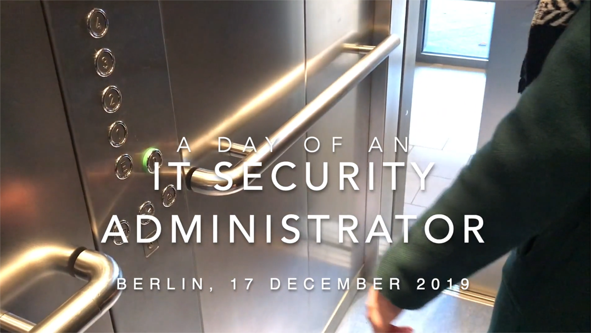
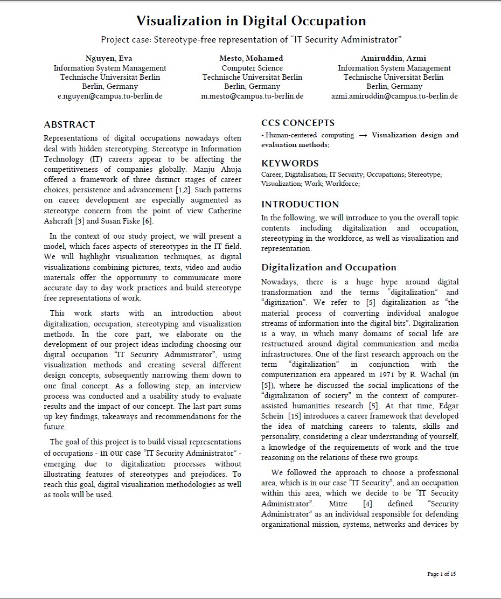

<table border=0>
<tr border=0>
<td>  </td>
  <td align="center"> <h5><a href="https://www.qu.tu-berlin.de/menue/qu/">
Institut für Softwaretechnik und Theoretische Informatik
</a> Quality and Usability Lab   
 </h5> </td>
  <td>  </td>
</tr>
<tr border=0>
<td> </td><td  align="center"><h5> Project Topic </h5> </td><td> </td>
</tr>
<tr border=0>
<td> </td><td> </td><td> </td>
</tr>
  <tr>
    <td> </td>
<td align="center"><h5><a href="https://github.com/MohamedMesto/Visualization-In-Digital-Occupation-Latex-Atlas.ti">Visualization In Digital Occupation Stereotype-free representation of “IT Security Administrator"</a></h5></td>
    <td> </td>
</tr>
  <tr>
    <td> </td>  <td align="center"><a href="https://www.linkedin.com/in/vera-schmitt/">Supervisor PhD. research assistant Vera Schmitt</a></td>
</tr>
</table>

# Visualization-In-Digital-Occupation
Project case: Stereotype-free representation of “IT Security Administrator”
## ABSTRACT
Representations of digital occupations nowadays often deal with hidden stereotyping. Stereotype in Information Technology (IT) careers appear to be affecting the competitiveness of companies globally. Manju Ahuja offered a framework of three distinct stages of career choices, persistence and advancement [1,2]. Such patterns on career development are especially augmented as stereotype concern from the point of view Catherine Ashcraft [3] and Susan Fiske [6].
In the context of our study project, we will present a model, which faces aspects of stereotypes in the IT field. We will highlight visualization techniques, as digital visualizations combining pictures, texts, video and audio materials offer the opportunity to communicate more accurate day to day work practices and build stereotype free representations of work.
This work starts with an introduction about digitalization, occupation, stereotyping and visualization methods. In the core part, we elaborate on the development of our project ideas including choosing our digital occupation “IT Security Administrator”, using visualization methods and creating several different design concepts, subsequently narrowing them down to one final concept. As a following step, an interview process was conducted and a usability study to evaluate results and the impact of our concept. The last part sums up key findings, takeaways and recommendations for the future.
The goal of this project is to build visual representations of occupations - in our case “IT Security Administrator” - emerging due to digitalization processes without illustrating features of stereotypes and prejudices. To reach this goal, digital visualization methodologies as well as tools will be used.
## Contributors
- Mohamed Mesto m.mesto@campus.tu-berlin.de  , Mohamedmesto111@gmail.com
- Amiruddin, Azmi  azmi.amiruddin@campus.tu-berlin.de , Azmi.my@gmail.com
- Nguyen, Eva e.nguyen@campus.tu-berlin.de

## Evaluation Grade from Quality and Usability Lab
1.0

## License & copyright
© Mohamed Mesto
License under the [MIT License] (LICENSE).

